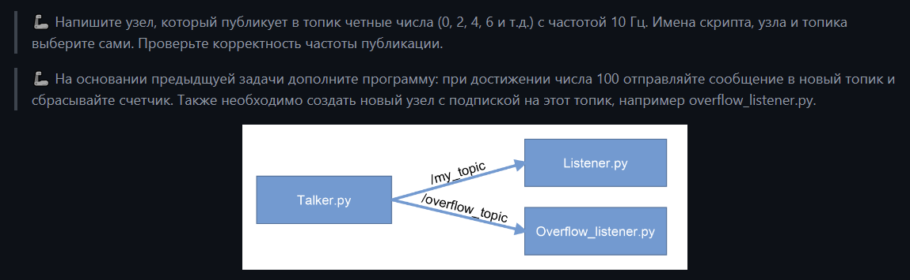
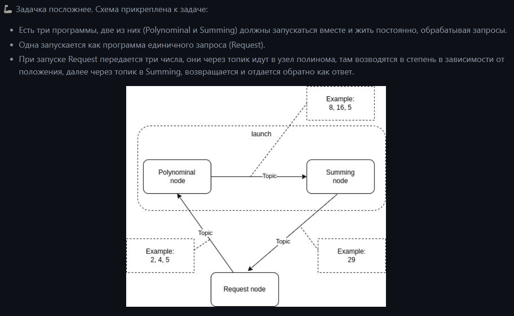
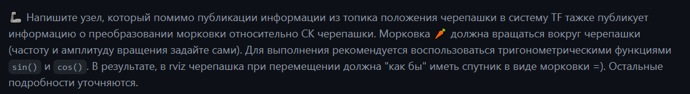

# ROS_course_labs
Репозиторий содержит результат выполнения лабораторных из данного курса по [ROS](https://github.com/lsd-maddrive/ROS_course/tree/main).


## Файловая система

* `img/` - изображения для `readme.md`
* `launch/` - файлы launch для каждой лабораторной 
* `rviz/` - конфиги rviz
* `src/` - хранит исходный код лабораторных


## Содержание лаб 

### Лаб 2
**Задание:**

**Запуск:**
```
roslaunch super_max_study_pkg lab2.launch
```

------------------

### Лаб 3
**Задание:**

**Запуск:**
* Запустить `polynom` и `summator`
```
roslaunch super_max_study_pkg lab3.launch
```

* Отправить три числа
```
rosrun super_max_study_pkg request.py _x3:=10 _x2:=10 _x1:=10
```

-----------------

### Лаб 4
**Задание:**
подробнее [тут](https://github.com/lsd-maddrive/ROS_course/blob/main/labs/04_TF.md)


**Запуск:**
```
roslaunch super_max_study_pkg turtle_tf_lab4.launch
```
