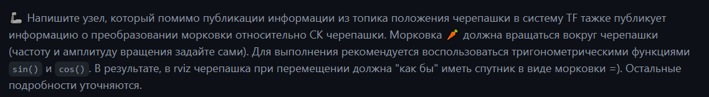

# ROS_lab
Ссылка на курс: [тут](https://github.com/lsd-maddrive/ROS_course/tree/main)


## Файловая система

* `img/` - изображения для `readme.md`
* `launch/` - файлы launch для каждой лабораторной 
* `rviz/` - конфиги rviz
* `src/` - хранит исходный код лабораторных


## Содержание лаб 

### Лаб 3
**Задание:**

**Запуск:**
```
roslaunch super_max_study_pkg lab3.launch
```
### Лаб 4
**Задание:**
подробнее [тут](https://github.com/lsd-maddrive/ROS_course/blob/main/labs/04_TF.md)


**Запуск:**
```
roslaunch super_max_study_pkg turtle_tf_lab4.launch
```